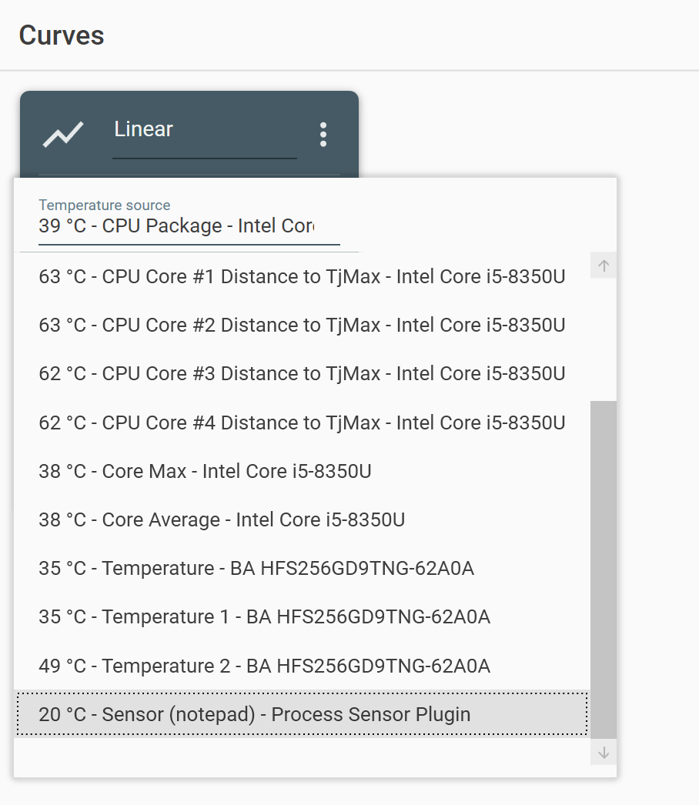
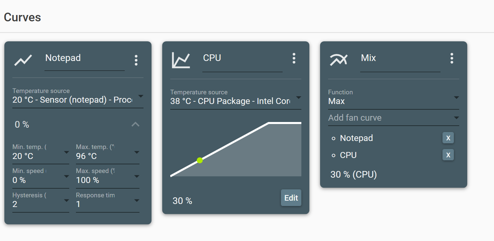

# FanControl.ProcessSensor
A plugin for [FanControl](https://github.com/Rem0o/FanControl.Releases) providing a temperature source that outputs a temperature that depends on the presence of a process. A typical use would be to kick fans to 100% when a crypto mining process was present.

## Installation
Assuming that you have FanControl extracted at `C:\FanControl` unzip the release archive into `C:\FanControl\Plugins`, so that the plugin DLL is located at `C:\FanControl\Plugins\FanControl.ProcessSensor.dll`.

## Configuration
The plugin is configurable using a `.cfg` file that exists alonside the DLL. Out of the box it will detect notepad, and output a temperature of 100°C if it's running.

The format of the configuration file is CSV, with one sensor per line. Lines starting with a # are ignored.
```
# Sensor name, processes, not detected temperature, detected temperature

# A sensor that reports 100°C if NiceHash is running
NiceHash Miner, app_nhm, 20, 100

# A sensor that reports 40°C is either notepad or calc are running
# Note the use of quotes around multiple values in a single column
Low load, "notepad, calculator", 20, 40
```
After restarting FanControl the new sensors will be available as a input into a curve.



You can combine them with real sensors using the `Mix` curve to perform a `max` operation. This will cause the new sensor to only override if it's higher that the real sensor.


## Remarks
The state of the sensor is updated at 0.1Hz.

## Building
This plugin was developed using Visual Studio 2019, targetting .NET Standard 2.0. You can build it using Visual Studio. It also supports github action triggers builds. This will create a release candidate when you open a pull request, and a release when it is merged to master.
